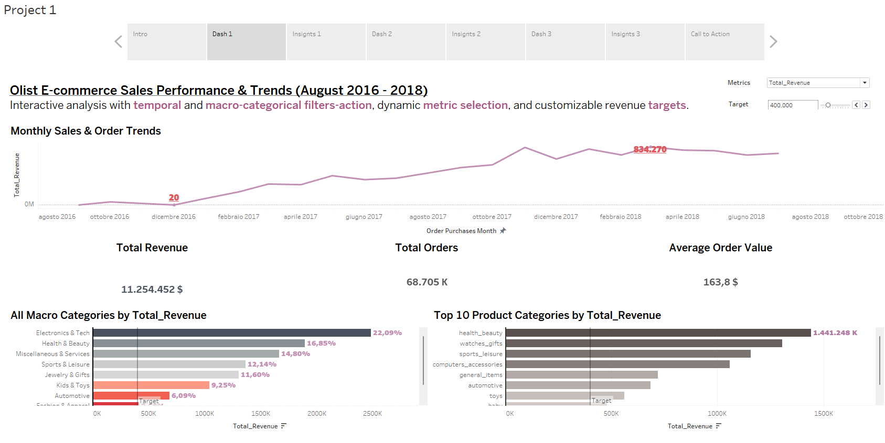
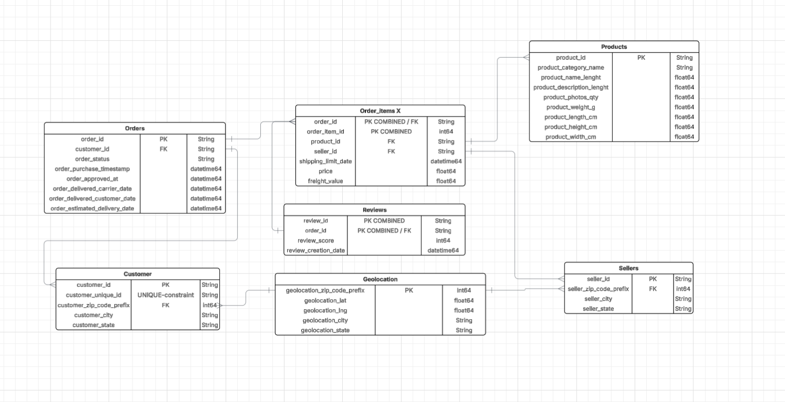

# Olist-E-Commerce-Project
Olist E-commerce Analysis: Strategic Insights This project delves into Olist's public dataset to uncover key business trends, sales performance, and crucial insights into customer satisfaction. The analysis provides actionable recommendations aimed at optimizing operations, expanding market reach, and enhancing the overall customer experience.

## Project Structure

-   **`notebooks/`**: Jupyter Notebooks for SQL queries ([`SQL_Queries_and_Insights.ipynb`](notebooks/SQL_Queries_and_Insights.ipynb)) and Exploratory Data Analysis ([`STATS-EDA.ipynb`](notebooks/STATS-EDA.ipynb)).
-   **`scripts/`**: Python script for data cleaning ([`CleanindData.py`](scripts/CleanindData.py)).
-   **`diagrams/`**: Entity-Relationship Diagram (ERD).
-   **`dashboard_screenshots/`**: Screenshots of the Tableau dashboard.

## Key Deliverables

### Data Cleaning Script

-   [`scripts/CleanindData.py`](scripts/CleanindData.py): Python script for cleaning, preprocessing, and standardizing the Olist dataset.

### SQL Analysis

-   [`notebooks/SQL_Queries_and_Insights.ipynb`](notebooks/SQL_Queries_and_Insights.ipynb): SQL queries for sales performance, revenue trends, and key business metrics.

### Exploratory Data Analysis (EDA)

-   [`notebooks/STATS-EDA.ipynb`](notebooks/STATS-EDA.ipynb): Detailed EDA and statistical insights.

### Interactive Dashboard (Tableau)

Explore the full dashboard on Tableau Public:

**Quick Overview:** This interactive Tableau dashboard provides a comprehensive overview of key sales metrics and trends within the Olist e-commerce business.

### Data Model (ERD)

Visual representation of the Olist dataset's database schema, showing tables and relationships for data understanding and efficient querying.

## Technologies Used

-   Python (Pandas, Numpy)
-   SQL
-   Jupyter Notebook
-   Tableau Public
-   GitHub
-   Lucidchart

## Author

-   Riccardo Lai
